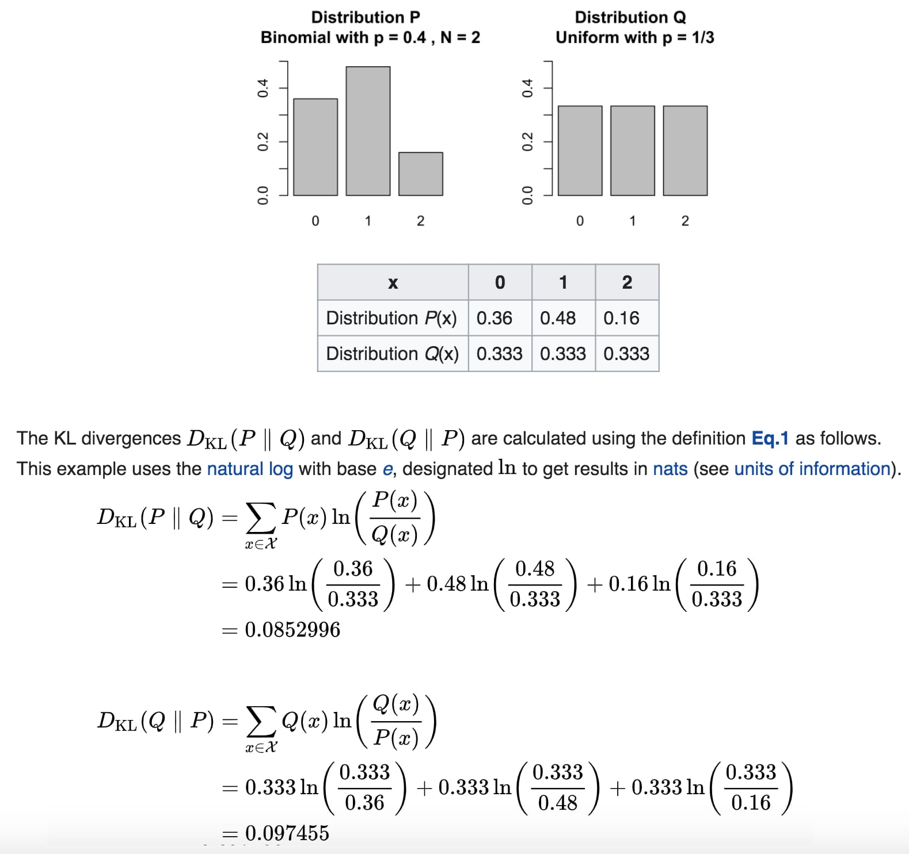

# Information Theory

- 1) [Information Theory](https://en.wikipedia.org/wiki/Information_theory)
- 2) [Entropy](https://en.wikipedia.org/wiki/Entropy_(information_theory))
- 3) [Differential Entropy](https://en.wikipedia.org/wiki/Differential_entropy)
- 4) [Conditional Entropy](https://en.wikipedia.org/wiki/Conditional_entropy)
- 5) [Joint Entropy](https://en.wikipedia.org/wiki/Joint_entropy)
- 6) [Mutual Information](https://en.wikipedia.org/wiki/Mutual_information)
- 7) [Conditional Mutual Information](https://en.wikipedia.org/wiki/Conditional_mutual_information)
- 8) [KL Divergence (Relative Entropy)](https://en.wikipedia.org/wiki/Kullback%E2%80%93Leibler_divergence)
- 9) [Entropy Rate](https://en.wikipedia.org/wiki/Entropy_rate)
- 10) [Asymptotic Equipartition Property](https://en.wikipedia.org/wiki/Asymptotic_equipartition_property)

# KL Divergence

